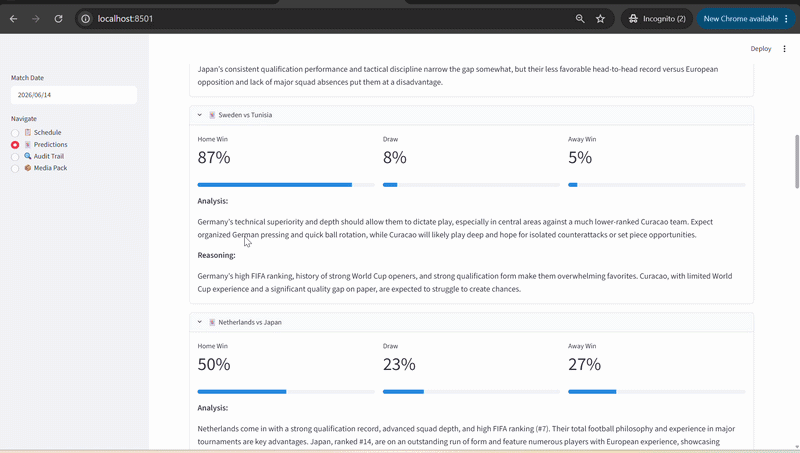
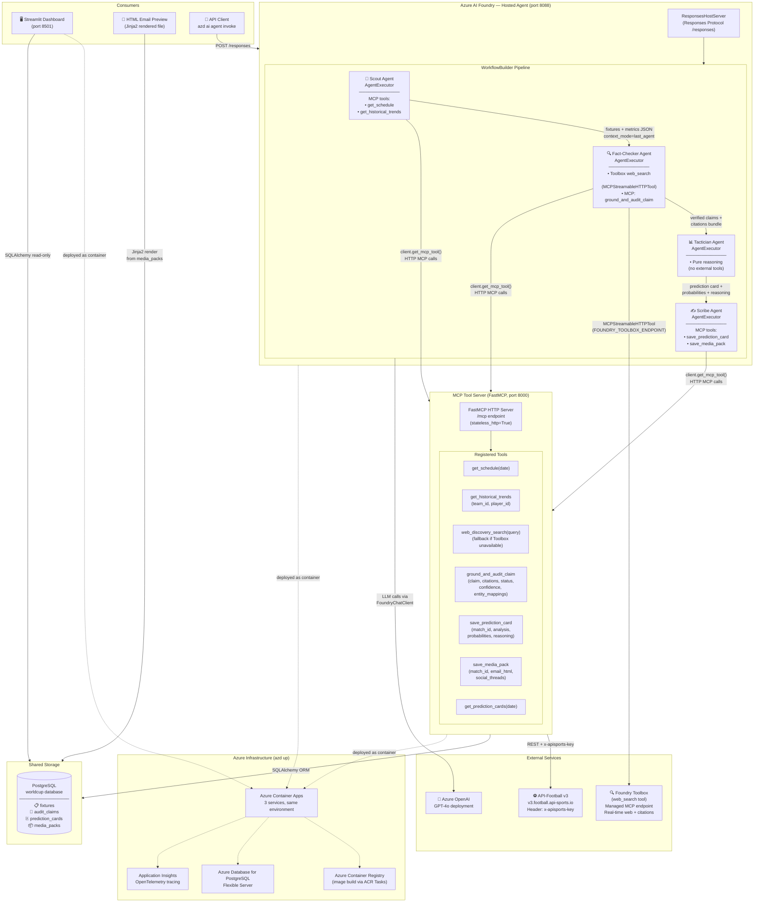
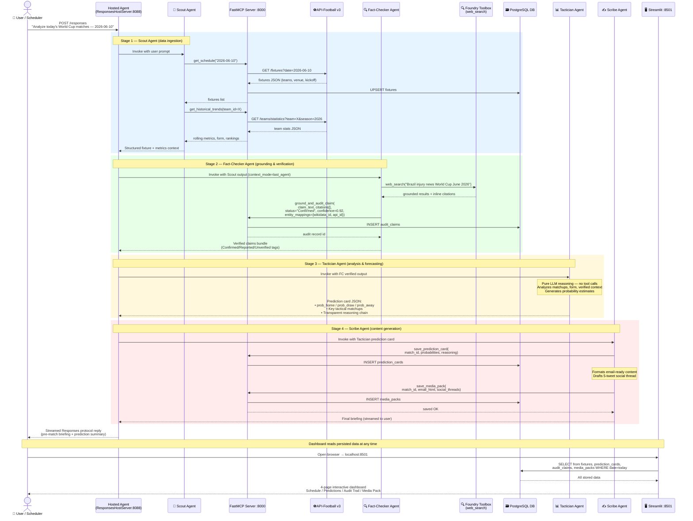
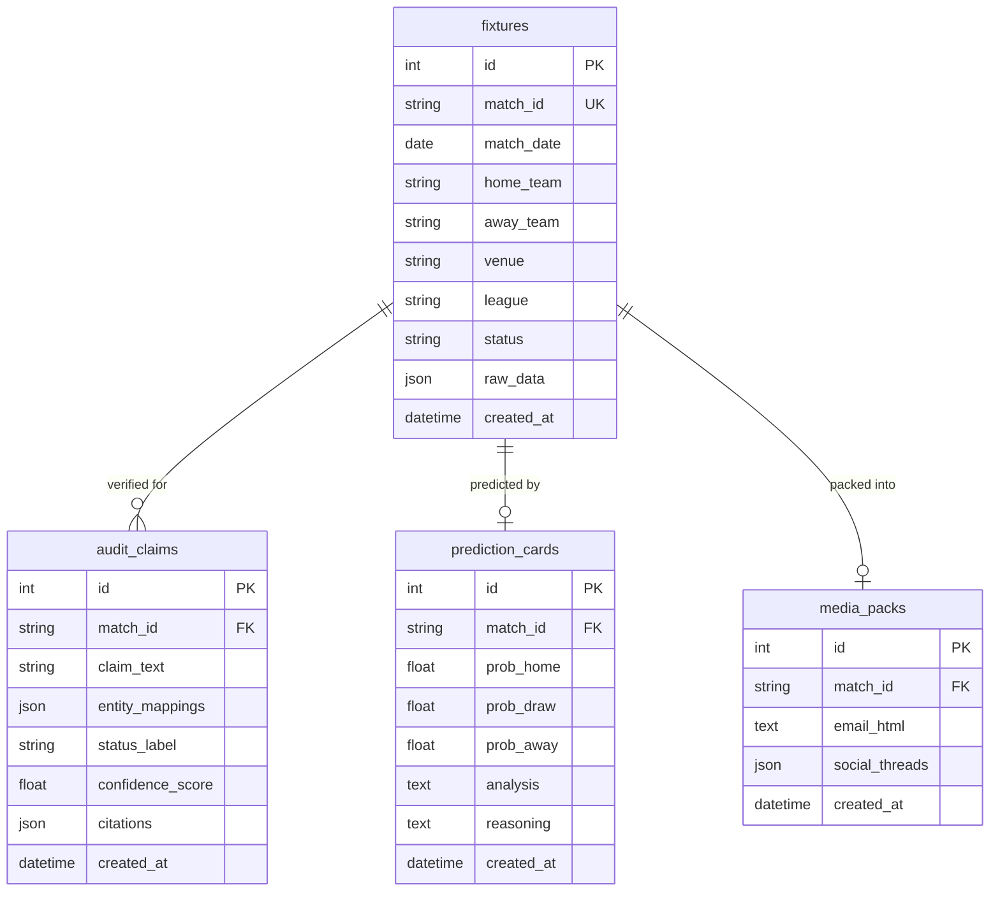
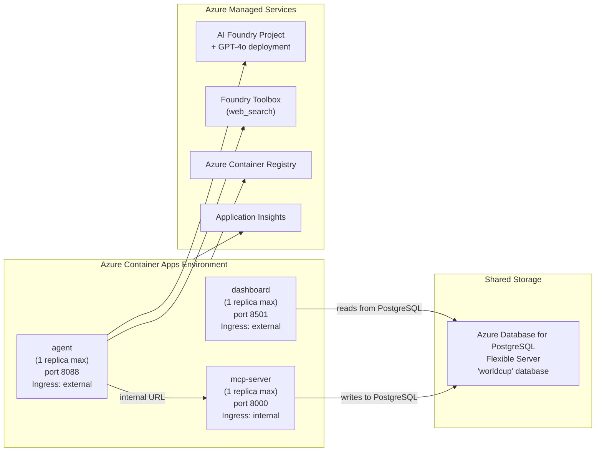
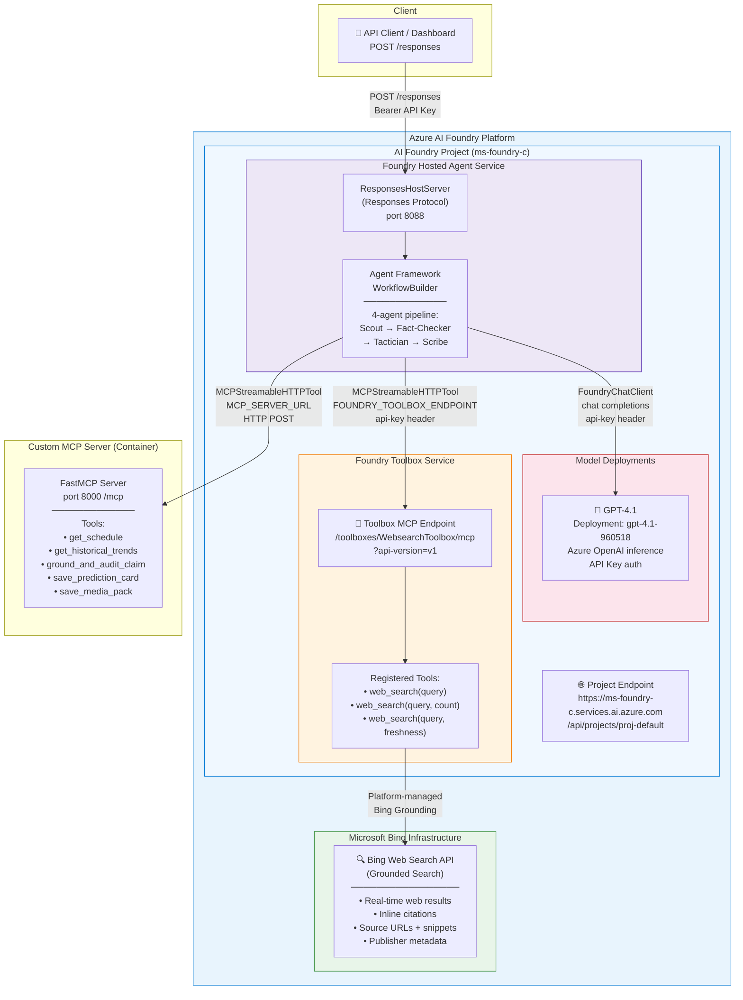
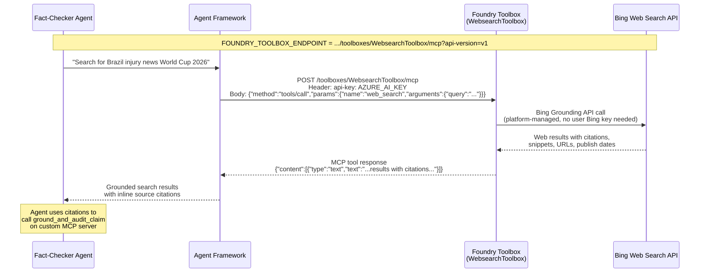

# World Cup 2026 AI Intelligence Platform

An AI-powered multi-agent platform delivering pre-match briefings, explainable prediction cards, audit-grounded fact checks, and media packs for the FIFA World Cup 2026.

## Demo



## Architecture

A collaborative multi-agent pipeline — **Scout → Fact-Checker → Tactician → Scribe** — runs as a single Microsoft Foundry Hosted Agent using the Agent Framework `WorkflowBuilder` pattern, backed by a dedicated MCP tool server and a Streamlit analytics dashboard.

| Service | Port | Description |
|---------|------|-------------|
| **MCP Server** | 8000 | FastMCP tool server (schedule, trends, grounding, persistence) |
| **Agent** | 8088 | Hosted Agent — Responses Protocol multi-agent workflow |
| **Dashboard** | 8501 | Streamlit analytics UI (schedule, predictions, audit trail, media packs) |

### System Architecture



### End-to-End Flow



### Database Schema



### Key Technical Decisions

| Decision | Choice | Rationale |
|---|---|---|
| Multi-agent pattern | `WorkflowBuilder` in-process pipeline (single hosted container) | Simpler deployment; single container; no inter-service auth overhead |
| MCP tool server | Separate container (FastMCP, port 8000) | Preserves protocol boundary; independently testable |
| Web search grounding | Foundry Toolbox `web_search` via `MCPStreamableHTTPTool` | Platform-managed citations; no manual Bing resource |
| Agent context passing | `context_mode="last_agent"` | Prevents context bloat; each agent only sees prior output |
| Storage | PostgreSQL (Docker container locally, Azure Database for PostgreSQL on Azure) | ACID-compliant; concurrent access; no file-locking issues |
| Deployment | `azd up` (single command) | Auto-provisions ACR, Container Apps, Foundry Toolbox, App Insights |

### Azure Deployment Architecture



### Azure AI Foundry — Agent & Toolbox Architecture



#### Toolbox Connection Flow



## Prerequisites

- Python 3.11+
- Docker/Podman with Compose support
- [Azure Developer CLI (`azd`)](https://learn.microsoft.com/azure/developer/azure-developer-cli/) *(for Azure deployment only)*
- An [API-Football](https://www.api-football.com/) API key
- Azure AI Foundry project endpoint + API key (for hosted agent & GPT-4.1)

## Quick Start (Local)

1. **Clone the repository**

   ```bash
   git clone <repo-url>
   cd AIHackathon
   ```

2. **Set environment variables**

   ```bash
   cp .env.example .env
   # Edit .env and fill in:
   #   FOOTBALL_API_KEY=<your-api-football-key>
   #   FOUNDRY_PROJECT_ENDPOINT=<your-azure-ai-foundry-endpoint>
   #   AZURE_AI_KEY=<your-foundry-api-key>
   #   AZURE_AI_MODEL_DEPLOYMENT_NAME=gpt-4.1-960518
   #   FOUNDRY_TOOLBOX_ENDPOINT=<optional-toolbox-endpoint>
   ```

3. **Run with Docker Compose or Podman**

   ```bash
   # Docker
   docker-compose up --build

   # Podman (drop-in replacement, no extra config needed)
   podman compose up --build
   ```

   This starts PostgreSQL, MCP server, agent, and dashboard containers.

   **Rebuild a single service after code changes:**

   ```bash
   # Rebuild and restart only the changed component (e.g. mcp-server)
   podman compose up --build mcp-server

   # Rebuild and restart the agent
   podman compose up --build agent

   # Rebuild and restart the dashboard
   podman compose up --build dashboard

   # Rebuild multiple changed services at once
   podman compose up --build mcp-server agent
   ```

   Add `-d` to run in detached mode (background):

   ```bash
   podman compose up --build -d mcp-server
   ```

4. **Access the dashboard**

   Open [http://localhost:8501](http://localhost:8501) in your browser.

5. **Invoke the agent**

   ```bash
   curl -X POST http://localhost:8088/responses \
     -H "Content-Type: application/json" \
     -d '{"input": "Analyze today'\''s World Cup matches"}'
   ```

   PowerShell:
   ```powershell
   Invoke-RestMethod -Uri "http://localhost:8088/responses" -Method POST `
     -ContentType "application/json" `
     -Body '{"input": "Analyze today''s World Cup matches"}'
   ```

## Deploy to Azure

```bash
azd up
```

This provisions Azure Container Apps, Azure Container Registry, Azure Database for PostgreSQL, and Application Insights via the `azure.yaml` configuration.

## Project Structure

```
├── agent/              # Hosted Agent (Responses Protocol, WorkflowBuilder)
├── mcp_server/         # FastMCP tool server
│   ├── tools/          # get_schedule, get_historical_trends, grounding, persistence
│   └── clients/        # API-Football v3 async client
├── dashboard/          # Streamlit 4-page analytics app
├── shared/             # Shared DB models, Jinja2 email templates
├── config/             # Settings (pydantic-settings)
├── data/               # Local data files
├── tests/              # Unit tests
├── azure.yaml          # Azure Developer CLI manifest
└── docker-compose.yml  # Local orchestration
```

## Agent Pipeline

| Stage | Agent | Role |
|-------|-------|------|
| 1 | **Scout** | Fetches fixtures & team metrics via MCP tools |
| 2 | **Fact-Checker** | Verifies claims using web search & grounding tools |
| 3 | **Tactician** | Pure LLM reasoning — generates predictions & analysis |
| 4 | **Scribe** | Premium Sports Journalist — produces campaign-style briefings, media packs, email HTML, and social hype threads |

### Scribe Output Format

The Scribe agent outputs a structured **Campaign Brief** per match:

- 🔥 **Campaign Brief** — match header
- 📍 **Competition Information** — tournament, stage, venue & atmosphere
- 📋 **Grounded Team Facts** — verified facts from Scout/Fact-Checker
- ⚡ **Match Highlights & What's Exciting** — narrative and tactical intrigue
- ⭐ **Exciting Players to Watch** — stats-backed star player spotlights
- 🧠 **Match Strategies** — win conditions from Tactician analysis
- 🔮 **Data-Backed Prediction** — historical context, probabilities, final verdict
- ⚠️ **Disclaimer** — "Predictions based on current data; football remains unpredictable!"

Media packs include visually compelling HTML emails and a 5-post social hype thread (hook → stat → player → tactics → prediction).

## Running Tests

```bash
pip install -r mcp_server/requirements.txt
pip install pytest
pytest tests/
```

## Utility Scripts

### Data Cleanup

Remove persisted data from PostgreSQL:

```bash
# Delete all data for a specific date
python scripts/cleanup_date.py 2026-06-14

# Delete ALL data (fixtures, predictions, media packs, audit claims)
python scripts/cleanup_date.py --all
```

### Wikipedia Data Sync

```bash
python scripts/sync_wikipedia_data.py
```

## Data Sources & Wikipedia Sync

The platform uses a multi-layered data strategy to ensure reliable operation even before the World Cup 2026 officially starts:

### Primary: API-Football v3 (Free Tier)

Live match data is fetched from [API-Football v3](https://www.api-football.com/) (`v3.football.api-sports.io`) using the World Cup league ID (`1`) and season `2026`. The platform uses the **free tier** subscription, which has the following limitations:

- **100 requests/day** rate limit
- Limited historical data depth
- No real-time lineups or live match events
- Delayed data updates compared to paid tiers

Due to these constraints, the platform relies heavily on pre-ingested fallback data to ensure consistent, rich analysis regardless of API availability.

### Fallback: Pre-Ingested Data from Wikipedia & Other Sources

To compensate for free-tier API limitations, the platform includes comprehensive pre-seeded CSV/JSON files in the `data/` directory, ingested from Wikipedia's [2026 FIFA World Cup](https://en.wikipedia.org/wiki/2026_FIFA_World_Cup) article, related pages, and other publicly available sources:

| File | Source | Contents |
|------|--------|----------|
| `worldcup2026.teams.csv` | Wikipedia team lists | 48 qualified teams with FIFA codes, ISO2 country codes, group assignments, and flag image URLs from Wikimedia Commons |
| `worldcup2026.games.csv` | Wikipedia match schedule | Full group stage fixture list with match dates, team IDs, stadium IDs, and kickoff times |
| `worldcup2026.stadia.csv` | Wikipedia venue articles | 16 host stadiums with city, country, capacity, and region |
| `worldcup2026.groups.csv` | Wikipedia group draw | Group compositions (A–L) with team assignments |
| `worldcup2026.groups.json` | Wikipedia group draw | Same as above in JSON format for programmatic access |
| `worldcup2026.players.json` | Wikipedia squad lists | Player data (name, position, club) for each national team |
| `worldcup2026.team_stats.json` | Wikipedia + historical data | Pre-tournament team statistics and performance metrics |

### Fallback Resolution Logic

The `FootballAPIClient` in `mcp_server/clients/football_api.py` implements automatic fallback to handle free-tier limitations gracefully:

1. Query API-Football for the requested data
2. If the API returns empty results, HTTP 429 (rate limit exceeded), or the daily quota is exhausted, load equivalent data from the local CSV/JSON files via `mcp_server/clients/fallback_data.py`
3. If no local files exist, use hardcoded seed fixtures for key match dates

This ensures the agent pipeline always has rich, complete data to work with — regardless of API-Football free-tier availability, rate limits, or whether the tournament has officially started. The ingested Wikipedia and public-source data provides the same level of detail (teams, squads, venues, historical stats) that a paid API tier would offer.

## License

See [LICENSE](LICENSE) for details.
