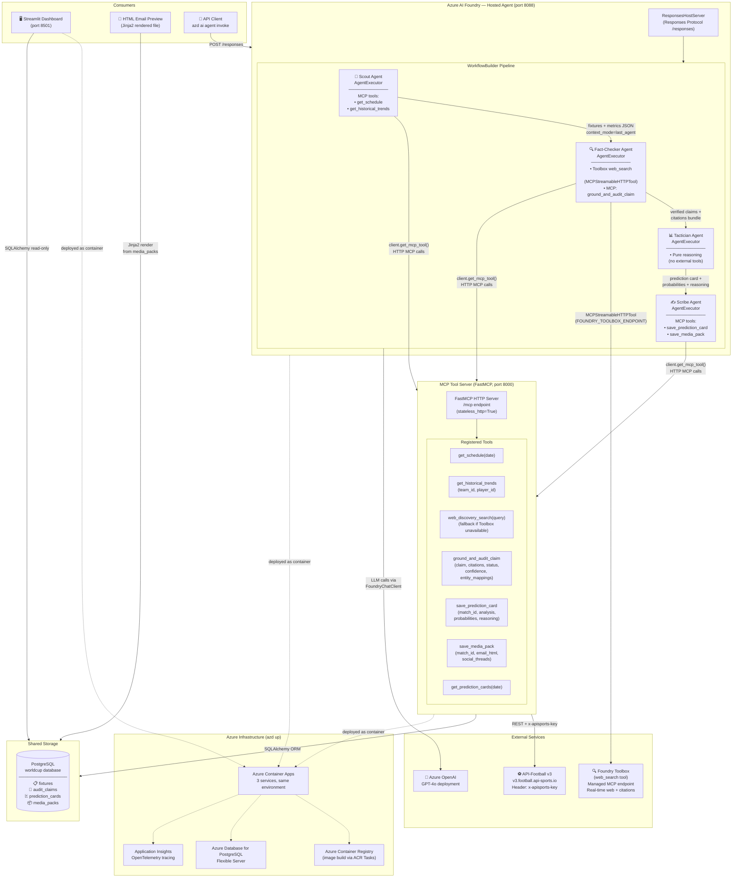
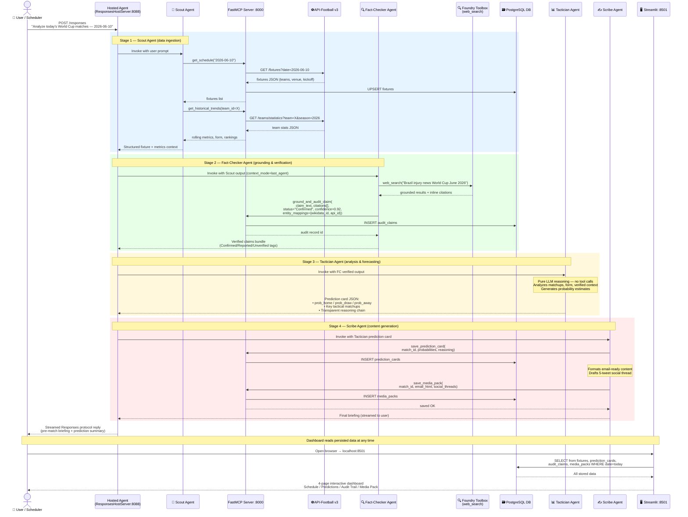
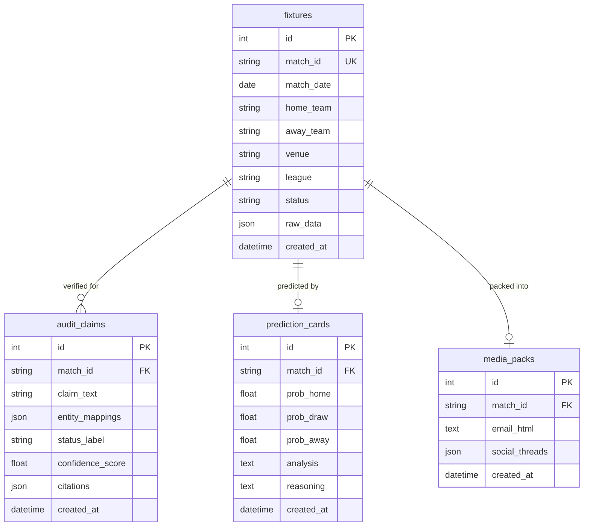
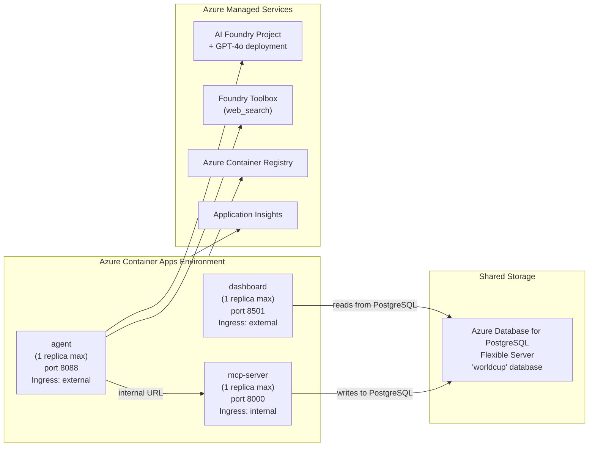

# World Cup 2026 AI Intelligence Platform

An AI-powered multi-agent platform delivering pre-match briefings, explainable prediction cards, audit-grounded fact checks, and media packs for the FIFA World Cup 2026.

## Architecture

A collaborative multi-agent pipeline — **Scout → Fact-Checker → Tactician → Scribe** — runs as a single Microsoft Foundry Hosted Agent using the Agent Framework `WorkflowBuilder` pattern, backed by a dedicated MCP tool server and a Streamlit analytics dashboard.

| Service | Port | Description |
|---------|------|-------------|
| **MCP Server** | 8000 | FastMCP tool server (schedule, trends, grounding, persistence) |
| **Agent** | 8088 | Hosted Agent — Responses Protocol multi-agent workflow |
| **Dashboard** | 8501 | Streamlit analytics UI (schedule, predictions, audit trail, media packs) |

### System Architecture



### End-to-End Flow



### Database Schema



### Key Technical Decisions

| Decision | Choice | Rationale |
|---|---|---|
| Multi-agent pattern | `WorkflowBuilder` in-process pipeline (single hosted container) | Simpler deployment; single container; no inter-service auth overhead |
| MCP tool server | Separate container (FastMCP, port 8000) | Preserves protocol boundary; independently testable |
| Web search grounding | Foundry Toolbox `web_search` via `MCPStreamableHTTPTool` | Platform-managed citations; no manual Bing resource |
| Agent context passing | `context_mode="last_agent"` | Prevents context bloat; each agent only sees prior output |
| Storage | PostgreSQL (Docker container locally, Azure Database for PostgreSQL on Azure) | ACID-compliant; concurrent access; no file-locking issues |
| Deployment | `azd up` (single command) | Auto-provisions ACR, Container Apps, Foundry Toolbox, App Insights |

### Azure Deployment Architecture



## Prerequisites

- Python 3.11+
- Docker & Docker Compose
- [Azure Developer CLI (`azd`)](https://learn.microsoft.com/azure/developer/azure-developer-cli/)
- An [API-Football](https://www.api-football.com/) API key
- Azure AI Foundry project endpoint (for hosted agent & GPT-4o)

## Quick Start (Local)

1. **Clone the repository**

   ```bash
   git clone <repo-url>
   cd AIHackathon
   ```

2. **Set environment variables**

   ```bash
   cp .env.example .env
   # Edit .env and fill in:
   #   FOOTBALL_API_KEY=<your-api-football-key>
   #   FOUNDRY_PROJECT_ENDPOINT=<your-azure-ai-foundry-endpoint>
   #   AZURE_AI_MODEL_DEPLOYMENT_NAME=gpt-4o
   #   FOUNDRY_TOOLBOX_ENDPOINT=<optional-toolbox-endpoint>
   ```

3. **Run with Docker Compose**

   ```bash
   docker-compose up --build
   ```

   This starts the PostgreSQL database, MCP server, agent, and dashboard containers.

4. **Access the dashboard**

   Open [http://localhost:8501](http://localhost:8501) in your browser.

5. **Invoke the agent**

   ```bash
   curl -X POST http://localhost:8088/responses \
     -H "Content-Type: application/json" \
     -d '{"input": "Analyze today'\''s World Cup matches"}'
   ```

## Deploy to Azure

```bash
azd up
```

This provisions Azure Container Apps, Azure Container Registry, Azure Database for PostgreSQL, and Application Insights via the `azure.yaml` configuration.

## Project Structure

```
├── agent/              # Hosted Agent (Responses Protocol, WorkflowBuilder)
├── mcp_server/         # FastMCP tool server
│   ├── tools/          # get_schedule, get_historical_trends, grounding, persistence
│   └── clients/        # API-Football v3 async client
├── dashboard/          # Streamlit 4-page analytics app
├── shared/             # Shared DB models, Jinja2 email templates
├── config/             # Settings (pydantic-settings)
├── data/               # Local data files
├── tests/              # Unit tests
├── azure.yaml          # Azure Developer CLI manifest
└── docker-compose.yml  # Local orchestration
```

## Agent Pipeline

| Stage | Agent | Role |
|-------|-------|------|
| 1 | **Scout** | Fetches fixtures & team metrics via MCP tools |
| 2 | **Fact-Checker** | Verifies claims using web search & grounding tools |
| 3 | **Tactician** | Pure LLM reasoning — generates predictions & analysis |
| 4 | **Scribe** | Produces media packs, email HTML, and social content |

## Running Tests

```bash
pip install -r mcp_server/requirements.txt
pip install pytest
pytest tests/
```

## License

See [LICENSE](LICENSE) for details.
